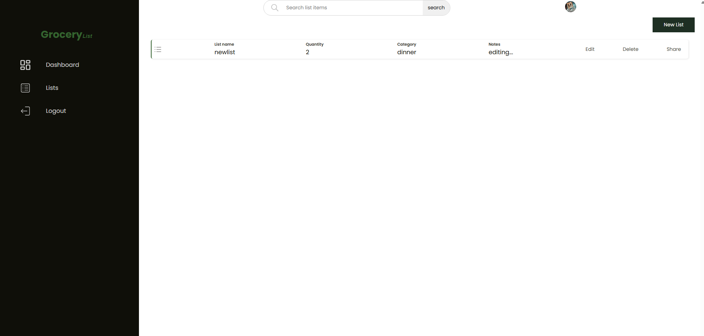
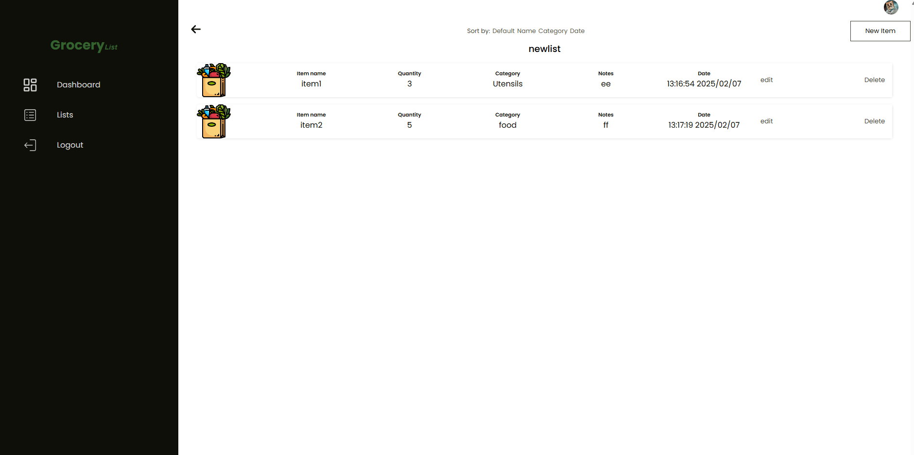

# Shopping List App

A simple shopping list app where users can add, update and delete lists.

## Installation

1. Clone the repository

```bash
git@github.com:Lspacedev/shopping-list-app.git
```

2. Navigate to the project folder

```bash
cd shopping-list-app
```

3.  Install all dependencies

```bash
npm install
```

4. Run the server

```bash
npx json-server --watch ./data/db.json --port 8000

```

5. Run the project

```bash
npm run start

```

## Screenshot




## Features

- Authentication: Create a user account.
- Authentication: Login to your account.

- View all your lists.
- View individual list.
- Add list.
- Update list.
- Delete list.
- Update account information.
- Add item.
- Update item.
- Delete item.

## Usage

1. Open the local site in your browser.
2. Create an account and login.
3. Add and manage your lists.

## Tech Stack

- ReactJs
- JSON sever

## Credits:

```python
<a href="https://www.flaticon.com/free-icons/groceries" title="groceries icons">Groceries icons created by justicon - Flaticon</a>
Photo by Lisa Fotios: https://www.pexels.com/photo/several-apples-beside-bread-pack-and-brown-paper-bag-1992912/
<a href="https://www.freepik.com/free-vector/order-processed-abstract-concept-illustration_20769828.htm#fromView=search&page=4&position=49&uuid=7dd923ee-53d5-47ef-9286-395ff5c3d6fb">Image by vectorjuice on Freepik</a>
```
